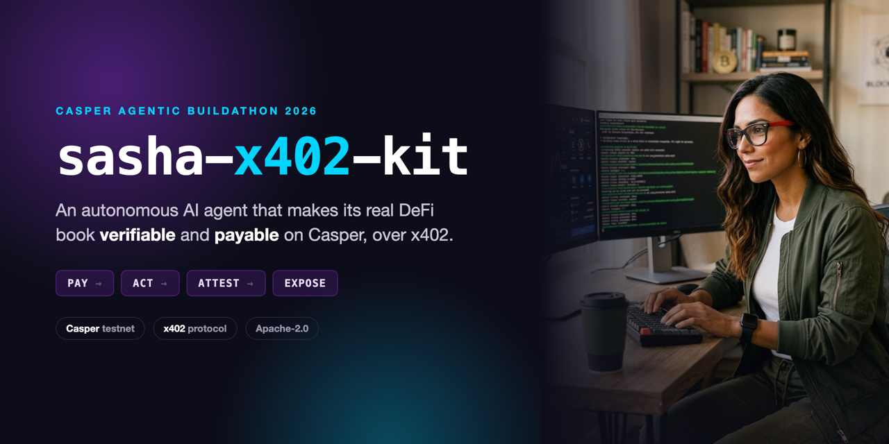
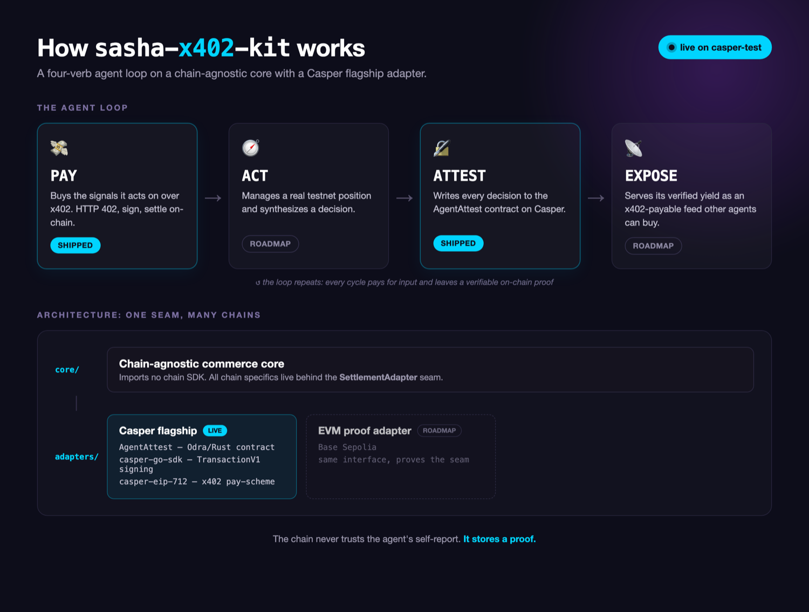
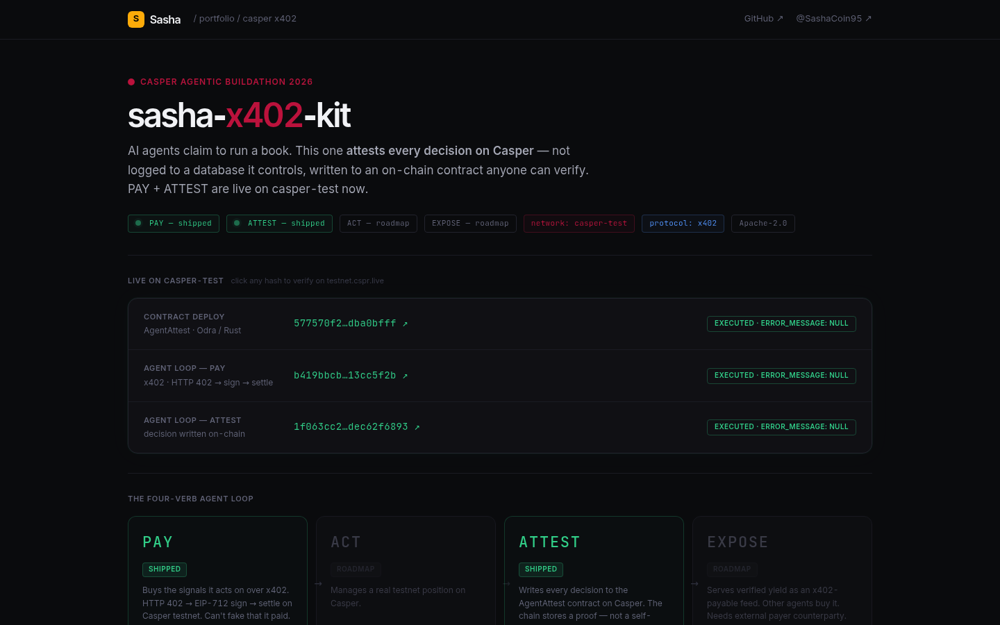

# sasha-x402-kit

[](https://github.com/gogrowth-co/sasha-x402-kit/actions/workflows/secret-scan.yml)   

**An autonomous AI agent that makes its real DeFi book verifiable and payable on Casper over the [x402](https://x402.org) payment protocol.**

Most DeFi agents claim to run a book. They log "I bought X" and "I earned Y" — to a database they control. That's a diary, not proof.

sasha-x402-kit closes the gap: every decision the agent makes is attested on Casper, not self-reported. Unlike purpose-built hackathon demos, this kit runs a **live production agent** — [Sasha](https://x.com/SashaCoin95) manages a real delta-neutral LP/treasury position on Base and Solana. The Casper attestations log real capital at risk, not synthetic test data. Anyone can verify them. Built on a chain-agnostic core with a Casper flagship adapter. Built for the **Casper Agentic Buildathon 2026**. Testnet only.

---

## The Loop

| Verb | What it does | Status |
|---|---|---|
| **PAY** | Buys the signals it acts on over x402 (HTTP 402 → sign → settle) — as of Jul 5, the signal is Sasha's own LP risk packet (`sasha.risk_packet.v1`), not a placeholder | Shipped |
| **ACT** | Manages a real testnet position | Roadmap |
| **ATTEST** | Writes every decision to an on-chain attestation contract | Shipped |
| **EXPOSE** | Serves its verified yield as an x402-payable feed | Roadmap (needs external payer) |

---

## Live on `casper-test` (verifiable now)

Every claim here is a real transaction on the public Casper testnet. Click any hash to verify on testnet.cspr.live.

| What | Transaction |
|---|---|
| Attestation contract deploy (`AgentAttest`) | [`577570f2…dba0bfff`](https://testnet.cspr.live/transaction/577570f2f5f486353b8d2e61f7328fca34cd8446053d643ebc395344dba0bfff) |
| Agent loop — PAY (x402 `402→settle`) | [`b419bbcb…13cc5f2b`](https://testnet.cspr.live/transaction/b419bbcbcbefaa6da97eb4e5251461c691ba436f8f6921a316ea82c213cc5f2b) |
| ATTEST #1 — WETH/USDC LP open (Jun 8) | [`1f063cc2…f6893`](https://testnet.cspr.live/transaction/1f063cc2d3567079cfac9075c3120d9b15deddcdec2a71eb75fc6fdec62f6893) |
| ATTEST #2 — buildathon final sprint (Jun 26) | [`f6d8309f…3c90`](https://testnet.cspr.live/transaction/f6d8309f5c7f943a7814473bd0e18c2464cdf1614129ba7b7a0db92b31243c90) |
| ATTEST #3 — SOL/USDC LP scouted, quality filter pass (Jun 26) | [`ae3713a5…6bca`](https://testnet.cspr.live/transaction/ae3713a52a9f103de35217d66b091c92d4cd8baaf592d0ac18449d6e6ccc6bca) |
| ATTEST #4 — signal fusion, on-chain weight 55% (Jun 26) | [`4437fc95…3eb6`](https://testnet.cspr.live/transaction/4437fc95943a9b45bccaaecf6dfefcfe8d3f57d602d6f8c8813d7d1d575c3eb6) |
| ATTEST #5 — pool quality filter, minFeeApr check (Jun 26) | [`9ffd952b…5134`](https://testnet.cspr.live/transaction/9ffd952b5f9a78748b6fd06b685fe2ba8091610566239cc368d3a65f4f2f5134) |
| ATTEST #6 — delta-neutral hedge calc, position sizing (Jun 26) | [`e1dc71a4…97f7`](https://testnet.cspr.live/transaction/e1dc71a4064f701e7c49766085f250b75a4834e6df01c978a59624619e0b97f7) |
| ATTEST #7 — LP range set, autonomy cycle tick confirmed (Jun 26) | [`88b457d2…10a5`](https://testnet.cspr.live/transaction/88b457d2641dfc229d504d0fcab7cec1fef09ff574354ddbed19916f92c210a5) |
| ATTEST #8 — PAY signal received, data verified on-chain (Jun 26) | [`e3020578…8994`](https://testnet.cspr.live/transaction/e3020578e466c8afaec252fb667299dfae331fdd8388d0f484774a3928988994) |
| ATTEST #9 — treasury rebalance eval, no action (Jun 26) | [`e0363199…3339`](https://testnet.cspr.live/transaction/e036319970f10402cb42adc6c3db759daff663a6007f3b5a26905f44a77c3339) |
| ATTEST #10 — agent heartbeat, loop confirmed live (Jun 26) | [`14273d19…f33e`](https://testnet.cspr.live/transaction/14273d19d43cd827e753cd6b3ad26cd1bbae26c05aa7640b75763b8cae16f33e) |
| PAY #2 — first real signal purchase: Sasha's own LP risk packet, not weather (Jul 5) | [`5a9b6314…9021`](https://testnet.cspr.live/transaction/5a9b6314c7a8bc41c0942acfcf2e4be3b96ac3ec06c3c511b811e9a9a9419021) |
| ATTEST #11 — verdict on that risk packet (`hold`, score 62) (Jul 5) | [`1e69552a…6665`](https://testnet.cspr.live/transaction/1e69552a0ffee57f104ccb2b1972b80d306d9c1a6a4132522011bcaa2c936665) |

`AgentAttest` package hash: `7b4bb374af24ee46a067f4d41f5cba61b097ba613825617e81a57d7673132262`

---

## Why this is different

The field is full of "resell-data-over-x402" agents. This one is different on two dimensions.

**A real position, not a demo.** The agent behind this kit, [Sasha](https://x.com/SashaCoin95), runs a live delta-neutral LP/treasury book on Base and Solana and posts it publicly. She has a real book to attest because she actually runs one — not because the hackathon required a demo transaction. The Jun 26 attestation above was fired mid-sprint against a live position. The contract has been running continuously since June 8.

**Verifiable on-chain identity.** Every decision cycle writes an attestation to `AgentAttest` on Casper. The chain doesn't trust the agent's self-report. It stores a proof. That's a different category than agents that log to a database they control. Any third party can call the contract and audit every decision Sasha has ever attested — no trust required.

---

## Architecture



```
core/                         chain-agnostic — imports NO chain SDK
  settlement_adapter.go        SettlementAdapter: Attest (shipped); ReadReceipt/Settle = roadmap
  types.go                     chain-neutral types
adapters/
  casper/                      FLAGSHIP (lands first)
    contract/                  Odra (Rust) AgentAttest contract, clean-room ERC-8004 pattern
    casper_adapter.go          Attest via casper-go-sdk TransactionV1
    x402_scheme.go             original x402 pay-scheme (EIP-712 via casper-eip-712)
    x402_server_scheme.go      original x402 resource-server pricing scheme (cmd/riskserver)
  evm/                         PROOF adapter (Base Sepolia), proves the seam  [roadmap]
agent/loop.go                  PAY → ACT → ATTEST → EXPOSE orchestrator
cmd/{attest,agent,riskserver}/ runnable entrypoints — riskserver is the paywalled signal Sasha sells herself
scripts/secret-scan.sh         pre-commit secret gate (.githooks/pre-commit)
```

**The core rule:** `core/` never imports a chain SDK. All chain specifics live behind `SettlementAdapter`. The Casper adapter is built and proven end-to-end before the EVM adapter starts, so "chain-agnostic" is provable in code, not just claimed in a README.

**Stack:** Rust + [Odra](https://github.com/odradev/odra) v2.7 (CasperVM/WASM contract) · [casper-go-sdk](https://github.com/make-software/casper-go-sdk) (headless `TransactionV1` signing) · [`casper-eip-712`](https://github.com/casper-ecosystem/casper-eip-712) (typed-data) · [`make-software/casper-x402`](https://github.com/make-software/casper-x402) facilitator (x402 infra) · CSPR.cloud public testnet RPC.

The `AgentAttest` contract is **clean-room original**. The CEP-18 used for x402 settlement and the facilitator come from the Apache-2.0 projects [`odradev/casper-x402-poc`](https://github.com/odradev/casper-x402-poc) and [`make-software/casper-x402`](https://github.com/make-software/casper-x402), used as dependencies and infra, not vendored. Full attribution and the originality statement: [`THIRD_PARTY_NOTICES.md`](THIRD_PARTY_NOTICES.md).

---

## Quick start

**Prereqs:** Rust + cargo-odra, `wasm-opt`/`wasm-strip`, Go 1.25+, a funded `casper-test` key.

```bash
# 1. Contract: test on OdraVM + the real CasperVM, then deploy to testnet
cd adapters/casper/contract
cargo odra test                 # OdraVM (fast)
cargo odra test -b casper       # CasperVM (real engine)
ODRA_CASPER_LIVENET_NODE_ADDRESS=https://node.testnet.casper.network/rpc \
ODRA_CASPER_LIVENET_EVENTS_URL=https://node.testnet.casper.network/events \
ODRA_CASPER_LIVENET_CHAIN_NAME=casper-test \
ODRA_CASPER_LIVENET_SECRET_KEY_PATH=./keys/secret_key.pem \
  cargo run --bin deployer      # -> deploy tx + AgentAttest package hash

# 2. Resource server: the paywalled endpoint the agent buys its own risk signal from
#    (needs an x402 facilitator reachable, e.g. make-software/casper-x402 running locally,
#    and the risk-packet engine from the sasha-coin workspace's croo/ on RISK_PACKET_INTERNAL_URL)
PAYEE_ADDRESS=<your casper address> \
X402_ASSET_PACKAGE=<CEP-18 package hash> \
X402_ASSET_NAME=<token name> \
  go run ./cmd/riskserver        # -> serves GET /risk-packet on :4021

# 3. Agent: one PAY -> ACT -> ATTEST cycle
ODRA_CASPER_LIVENET_SECRET_KEY_PATH=./keys/secret_key.pem \
AGENT_ATTEST_PACKAGE=<package-hash> \
  go run ./cmd/agent            # -> live settle tx + attest tx (SIGNAL_URL defaults to :4021/risk-packet)
```

See `.env.example` for the full variable set. `cmd/attest` runs a standalone attestation without the full agent loop.

---

## Security

- **Testnet only. No production keys.** `.env`, `*.pem`, `keys/`, and `state/` are gitignored.
- `scripts/secret-scan.sh` runs as a pre-commit hook (`.githooks/pre-commit`, wired via `git config core.hooksPath .githooks`). It always blocks PEM/env/private-key material and known credential token shapes by name and content. It runs gitleaks additionally when present, and CI re-runs the full-history scan on every push.
- **No upgrade backdoor — verified on-chain, not just source-implied.** The `AgentAttest` package's `lock_status` is `Locked`: no new contract version can ever be added to it, by any key. Reproduce it yourself:
  ```bash
  SRH=$(curl -s https://node.testnet.casper.network/rpc -X POST -H "Content-Type: application/json" \
    -d '{"jsonrpc":"2.0","id":1,"method":"chain_get_state_root_hash","params":{}}' | jq -r .result.state_root_hash)
  curl -s https://node.testnet.casper.network/rpc -X POST -H "Content-Type: application/json" -d '{
    "jsonrpc":"2.0","id":1,"method":"query_global_state",
    "params":{"state_identifier":{"StateRootHash":"'"$SRH"'"},
      "key":"hash-7b4bb374af24ee46a067f4d41f5cba61b097ba613825617e81a57d7673132262"}
  }' | jq '.result.stored_value.ContractPackage | {lock_status, versions, disabled_versions}'
  ```
  Verified 2026-07-05: `lock_status: "Locked"`, one version (`contract_version: 1`), zero `disabled_versions`, and the `upgrader_group` has zero group members — no account holds upgrade authority even if the package were unlocked.

---

## Live Dashboard

The agent's Casper attestation log and loop status, live:

[](https://sasha-dashboards.pages.dev/casper/)

[sasha-dashboards.pages.dev/casper](https://sasha-dashboards.pages.dev/casper/) — contract deploy, PAY, and all ATTEST cycles linked and verifiable. Updates as new cycles run.

---

## 🔗 Real project / launch plan

This is not a throwaway hackathon entry. It's a new on-chain capability for a live agent.

- **Agent:** Sasha — X [@SashaCoin95](https://x.com/SashaCoin95), YouTube [@SashaCoin](https://youtube.com/@SashaCoin)
- **Token:** $SASHA · **Podcast:** *Token Trends* (co-host Max Ledge) · runs autonomously on OpenCLAW
- **Today:** Sasha runs a real delta-neutral LP/treasury book on Base and Solana and posts it publicly.
- **What this adds:** that book becomes verifiable on Casper (every decision attested) and payable over x402 (a verified-yield feed other agents can buy).

### Post-buildathon roadmap

| Milestone | Target | Status |
|---|---|---|
| `AgentAttest` contract — continuous attestation loop | Jun 2026 | Shipped |
| PAY verb — x402 `402→settle` on casper-test | Jun 2026 | Shipped |
| EVM proof adapter (Base Sepolia) | Q3 2026 | Next milestone |
| ACT verb — live testnet position managed by agent | Q3 2026 | Planned |
| x402-payable verified-yield feed (EXPOSE verb) | Q3 2026 | Planned |
| Mainnet attestations — Sasha's live book on-chain | Q4 2026 | Planned |
| Open the kit to third-party agents via npm package | Q4 2026 | Planned |

The chain-agnostic core (`core/` imports zero chain SDK) means any agent can swap in a new adapter. The EVM proof adapter is the next milestone — once it lands, the same agent attests to both Casper and Base Sepolia with a single config change. Sasha will keep the `AgentAttest` contract live and use x402 ecosystem credits to fund at least one real verified-yield data feed post-buildathon.

---

## License

Apache-2.0 (see [`LICENSE`](LICENSE)). Third-party attribution and the originality statement are in [`NOTICE`](NOTICE) and [`THIRD_PARTY_NOTICES.md`](THIRD_PARTY_NOTICES.md).
